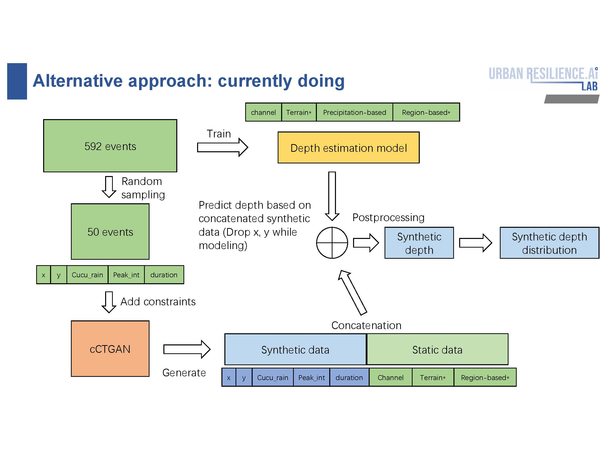
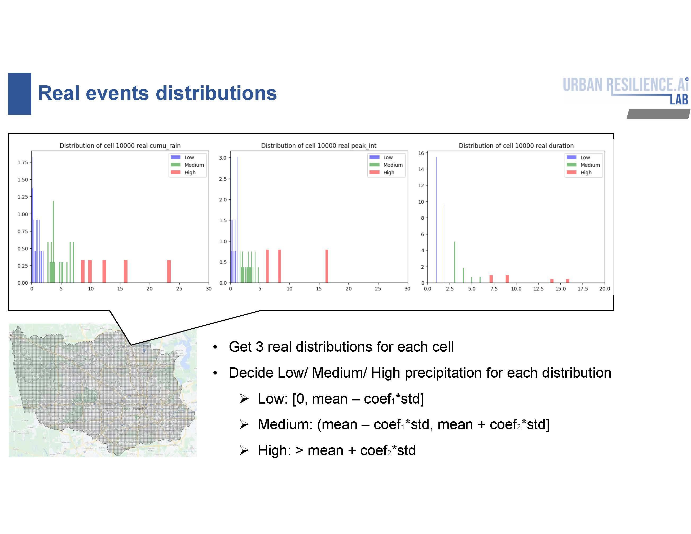
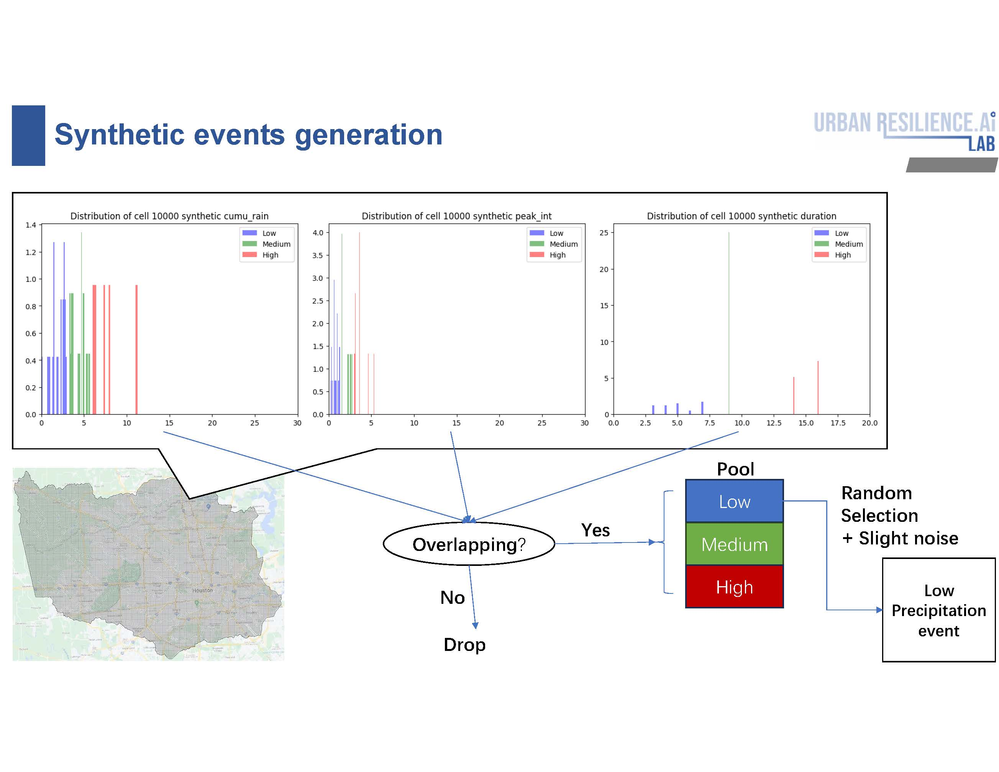

# FLow Design

# Synthetic events separation Design
## Real events part
For each cell:
- 1. Get distributions of `cumu_rain`, `peak_int`, and `duration`.
- 2. Determine Levels: [Low, Medium, High] for each distribution by:
  - 2.1. Low: $[0, mean - coef_1 \cdot std)$
  - 2.2. Medium: $(mean - coef_1 \cdot std, mean + coef_2 \cdot std]$
  - 2.3. High: $> mean + coef_2 \cdot std$

## Synthetic events part
For each cell:
- 1. Separate each distribution into 3 segments by determined real thresholds
- 2. Check if rows filling in the overlapping of the determined class among 3 distributions
    - Yes: Move rows into the determined class pool.
    - No: Drop.
- 3. When creating determined class events, random sample the rows from their corresponding pools.
    - *: if the pool size of specific rows is lower than the average size, add slight noise when sampling. 

