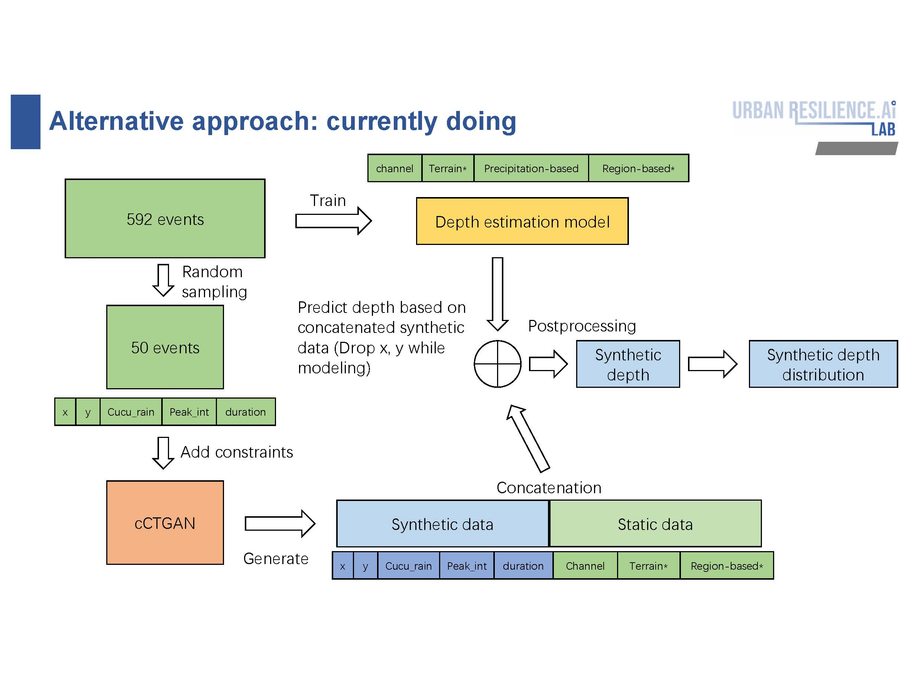
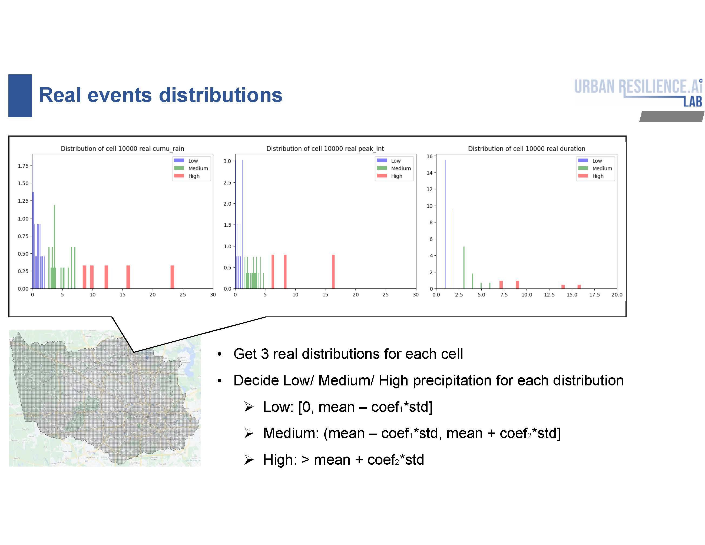
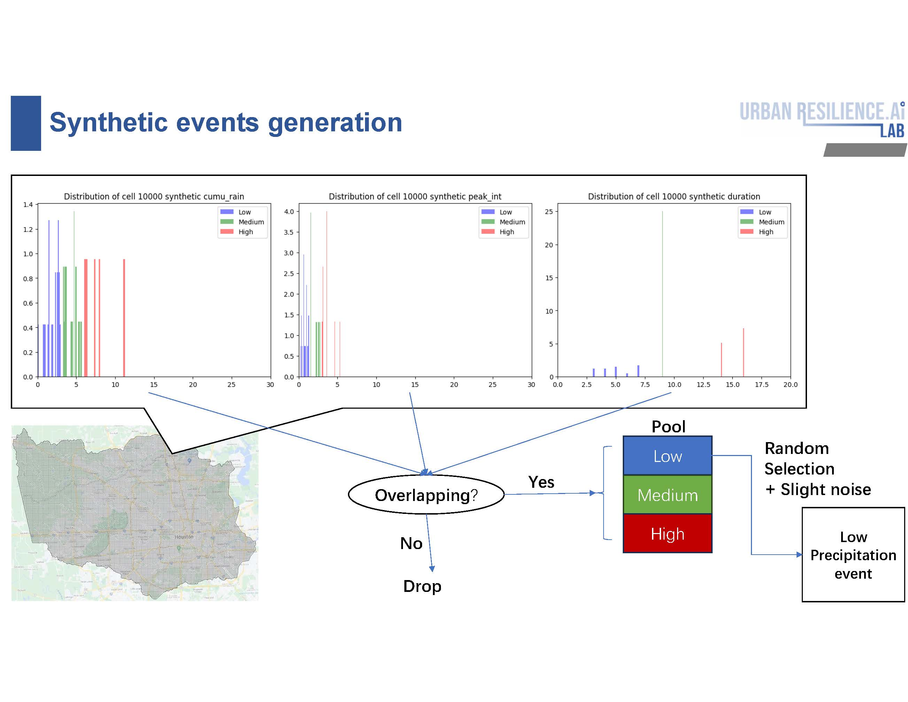
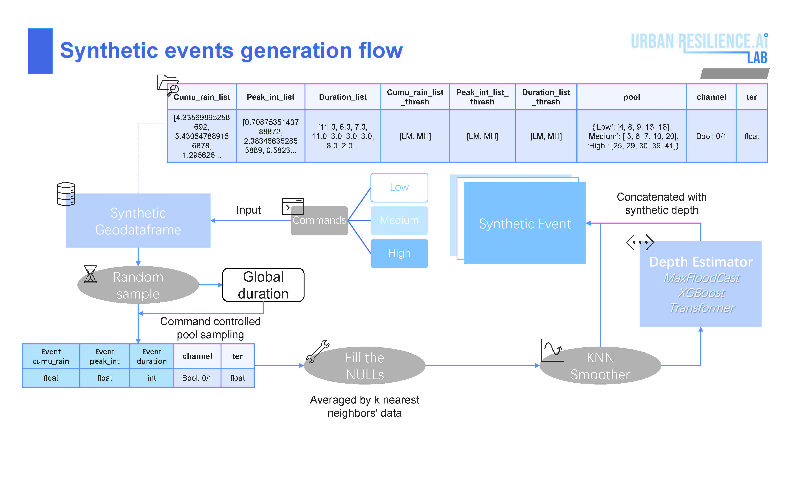

The final objective of this project is to generate depth distribution for each cell mesh given different preipitation criteria.
# Flow Design

## Depth estimator training
Train a regression transformer to estimate the depth by 592 real events involving `channel`, `terrain`, `precipitation-based features` and `region-based features` (optional).
## cCTGAN modeling
Random sample 50 real events to train CTGAN with features: `x`, `y`, `cumu_rain`, `peak_int` and `duration`.

Add constraints: 
- Positive constraints
- Inequalty constraints: `cumu_rain` $\geq$ `peak_int`
- Custimized logic: `peak_int` $\geq$ `cumu_rain` / `duration`
Save checkpoints for each pair of D/G learning rates and every 50 epochs and generate 5,000,00 samples each for grid search.
## Synthetic depth generation
For the optimal checkpoint, concatenate the synthetic precipitation-based features and cooresponding spatial features to predict synthetic depth by trained depth estimator. 

After that, we will form separated synthetic events by following methods.
# Synthetic events separation Design

## Real events distribution determination

For each cell:
- Get distributions of `cumu_rain`, `peak_int`, and `duration`.
- Determine Levels: [Low, Medium, High] for each distribution by:
  - Low: $[0, mean - coef_1 \cdot std)$
  - Medium: $(mean - coef_1 \cdot std, mean + coef_2 \cdot std]$
  - High: $> mean + coef_2 \cdot std$

## Synthetic events distribution control

For each cell:
- Separate each distribution into 3 segments by determined real thresholds
- Check if rows filling in the overlapping of the determined class among 3 distributions
    - Yes: Move rows into the determined class pool.
    - No: Drop.
- When creating determined class events, random sample the rows from their corresponding pools.
    - *: if the pool size of specific rows is lower than the average size, add slight noise when sampling. 

## Synthetic events generation

- Given input command `Low`, `Medium` or `High`, `event_duration` will be sampled randomly from the pool and set globally and then the corresponding `event_cumu_rain`, `event_peak_int` will be sampled randomly from the pool as well given the constriants of `event_duration`.
- The sampled synthetic precipitation-based features will concatenate with corresonding spatial features `channel` and `terrain` to form a complete feature input.
- To address the `NULL` caused by feature pool selection, each `NULL` will be the average value of its k nearest neighbors (KNN).
- In addition, KNN smoother will be applied on `event_cumu_rain` and `event_peak_int`.
- Finally, the synthetic depth generated by depth estimator will concatenate with features to plot maps.

